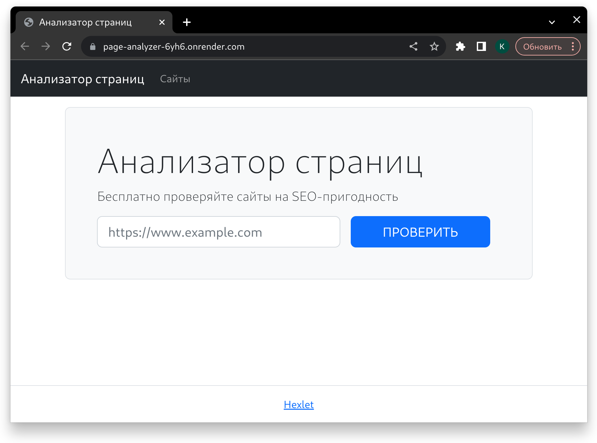

# Анализатор страниц — приложение на базе фреймворка Flask
### https://page-analyzer-6yh6.onrender.com/

___
  
___
- Приложение принимает урл от пользователья
- Проверяет валидность введенных данных
- Валидный урл добавляет в postgresql базу данных
- Отправляет запрос к урл
- Полученную информацию сохраняет в базу данных
___
### Приложение использует:
- Poetry 1.5.1
- Python 3.10
- Flask 2.3.2
- python 3.10
- gunicorn 20.1.0
- validators 0.20.0
- psycopg2-binary 2.9.6
- requests: 2.31.0
- beautifulsoup4 4.12.2
- python-dotenv 1.0.0
___
### Команды Makefile:
- make start — запуск сервера
- make start-debug — запуск сервера в режиме дебаг
- make lint — линтер flake8
- make pytest — тесты